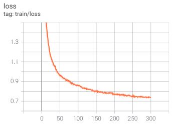
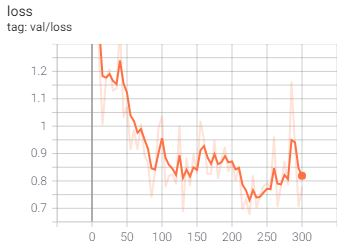
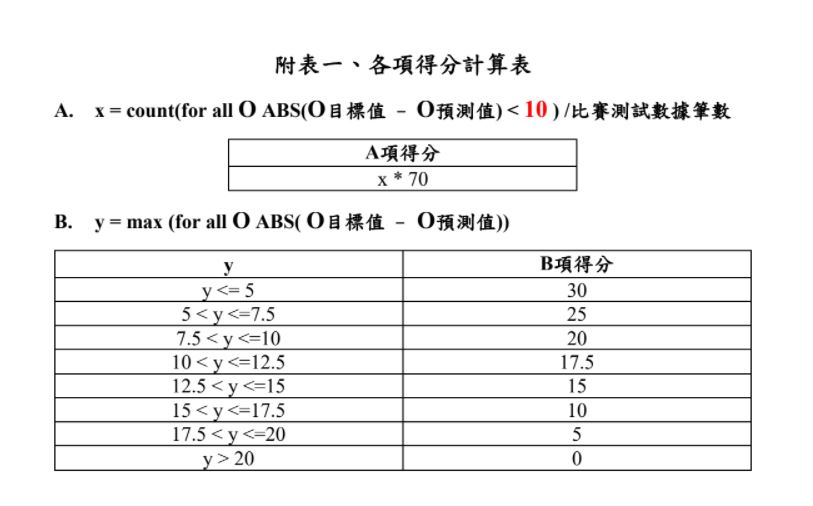
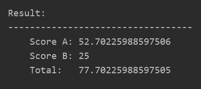

# Pytorch-2021-IMBD-Reggression
- [2021全國智慧製造大數據分析競賽](https://imbd2021.thu.edu.tw/)  

```
├── README.md    

主要訓練程式碼
├── train.py                執行訓練檔
├── training.yaml           調整訓練參數
├── dataset.py              讀取訓練驗證資料
├── model.py                網路架構

主要測試程式碼   
├── test.py                 執行測試檔      

其他程式碼
├── utils
|    ├── csv_utils           csv檔相關函式
|    ├── dir_utils           路徑相關函式
|    ├── model_utils         網路模型相關函式
|    └── score_utils         計算分數相關函式
├── csv_data
|    ├── result                   
|    |   └── result.csv      預測結果csv檔    
|    ├── testing
|    |   └── test.csv        測試輸入csv檔           
|    └── training
|        ├── val.csv         驗證csv檔
|        └── train.csv       訓練csv檔
└── checkpoint
     └── Network             .yaml (Network名稱)
         ├── log             存log檔的資料夾
         |   └──...
         └── model           存模型檔的資料夾
             └──...

```

# 1. Training  

## 1.1 Prepair training data  
- Official [training data](https://drive.google.com/file/d/1xj7Wpev5k48hP6nBoEFJURd-hoPy4Bzv/view?usp=sharing): 98072  

- Split training data to train, val and test part:  
  - [train.csv](https://drive.google.com/file/d/1L389britWH1_e1Xb_3XACHeV0Yz2RwqV/view?usp=sharing): 97000  
  - [val.csv](https://drive.google.com/file/d/1dZtR1xRfyLnoGqfuenvAWMCxprxZ8D3K/view?usp=sharing): 1000  
  - [test.csv](https://drive.google.com/file/d/1AShQtKNL_d_ePbihX2n2lEyrsGCP5fJs/view?usp=sharing): 72  

## 1.2 Set hyperparameters and train  
- Configuration file: `training.yaml`  
- Start training: `train.py`  
    ```
    python train.py
    ```
## 1.3 Training and validation loss curve  
- log file direction: `checkpoints -> log` folder  
    ```
    tensorboard --logdir [log path]
    ```
- training loss example:  
    
  
- validation loss example:  
     


# 2. Testing

## 2.1 Load the model and test  
- Model weight file direction: `checkpoints -> model` folder  
- Start testing: `test.py`  
    ```
    python test.py
    ```
    
## 2.2 Score  
- Official score calculate rule:  

    
  
- Final score example:  

    


# 3. Reference  
- https://lulaoshi.info/machine-learning/neural-network/pytorch-kaggle-house-prices.html  
- https://shashikachamod4u.medium.com/excel-csv-to-pytorch-dataset-def496b6bcc1  
- https://blog.csdn.net/just_sort/article/details/103110806  

  
# 4. Contact us:  
- Chi-Mao Fan: qaz5517359@gmail.com  
- 


