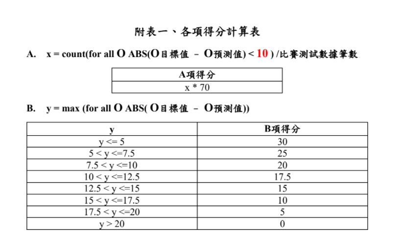

# Colab-2021-IMBD-Reggression

# 1. Training  

## 1.1 Prepair training data  
- Official [training data](https://drive.google.com/file/d/1xj7Wpev5k48hP6nBoEFJURd-hoPy4Bzv/view?usp=sharing): 98072  

## 1.2 Upload relevant csv data to colab  
- Example:  
  </a>  

## 1.3 Set hyperparameters and start training  
- Example:  
  </a>  

# 2. Testing  
## 2.1 Prepair preliminary testing data  

- Official [preliminary testing data](https://drive.google.com/file/d/17b03rxEfXTGlcSLJCv-W-ctTWsYwhA3c/view?usp=sharing): 7222  

## 2.2 Load the model or pretrained model    
- Pretrained model(MLP: 13-128-256-128-1): model_best.pth  
- 
## 2.3 Set hyperparameters and start testing  
- Example:  
</a>  

## 2.3 Score  
- Official score calculate rule:  

    
  
- Result csv will generate on the result_dir and save to "result.csv"  
  </a>  
  
